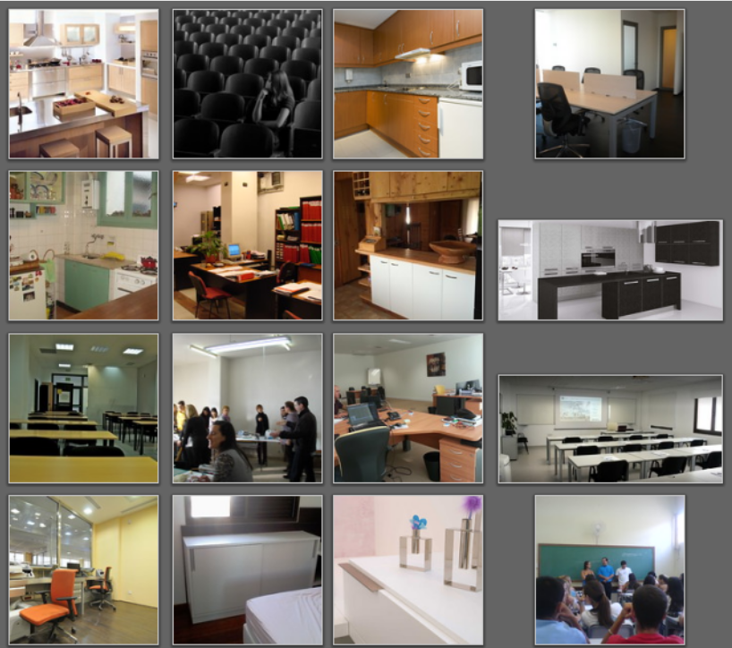
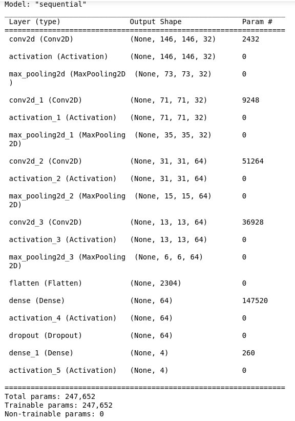
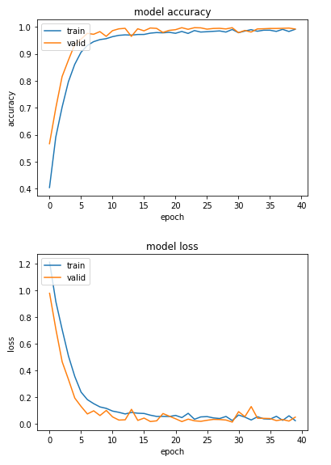

# Pattern recognition (Part 4/4)

#### 👨‍🎓 This project was carried out during my master's degree in computer vision at URJC - Madrid 

The aim of this exercise is to classify four types of images using deep learning (tensorflow).

The four types of images will be: classroom, kitchen, dormitory and office.

For this purpose we have decided to solve this exercise with a Convolutional Neural Network (CNN).

## Goals

- Construct a CNN.
- Have model score (accuracy) >= 0.9

## Requirements

* Python 3.7+
* Jupyter notebook


* matplotlib == 3.3.4
* numpy == 1.21.3
* scikit_learn == 1.1.1
* pillow == 9.2.0
* tensorflow == 2.6.0


How to install all the requirements :
```bash
$ pip install -r requirements.txt
```

## Usage

Execute only from project directory
```bash
$ jupyter notebook src/main.ipynb
```

## Structure

    .
    ├── datasets
    │        ├── test
    │        └── train
    │            ├── aula
    │            ├── cocina
    │            ├── dormitorio
    │            └── oficina
    ├── imgs
    │        ├── Figure_1.png
    │        ├── Figure_2.png
    │        └── Figure_3.png
    ├── model
    │        └── best_model.h5
    ├── predictions
    │        └── reto4_Ypred.csv
    ├── README.md
    ├── requirements.txt
    ├── Reto4.pdf
    └── src
        └── main.ipynb


## Examples

These are the images used to train our model



The convolutional neural network structure



This are some results of the model (score = 0.992)



## Authors

* **Luis Rosario** - *Member 1* - [Luisrosario2604](https://github.com/Luisrosario2604)
* **Vicent Gilabert Maño** - *Member 2* - [Vicent](https://github.com/vgilabert94)
